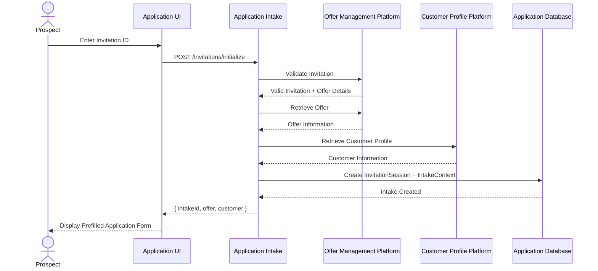
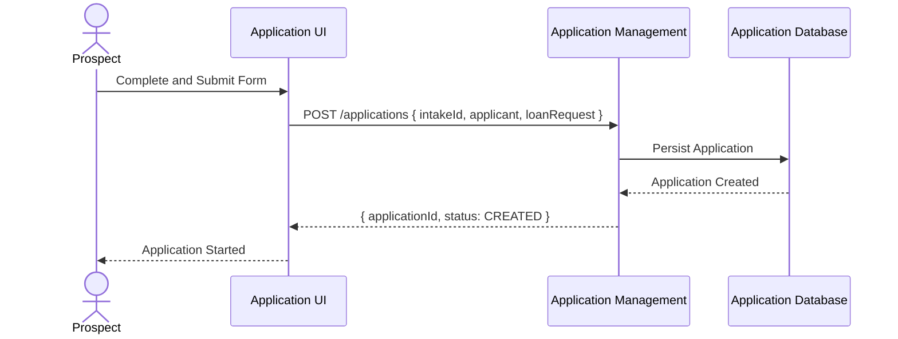
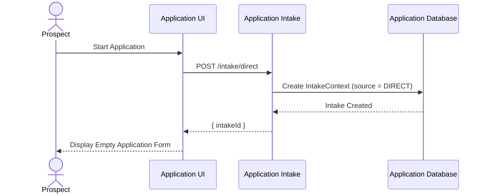
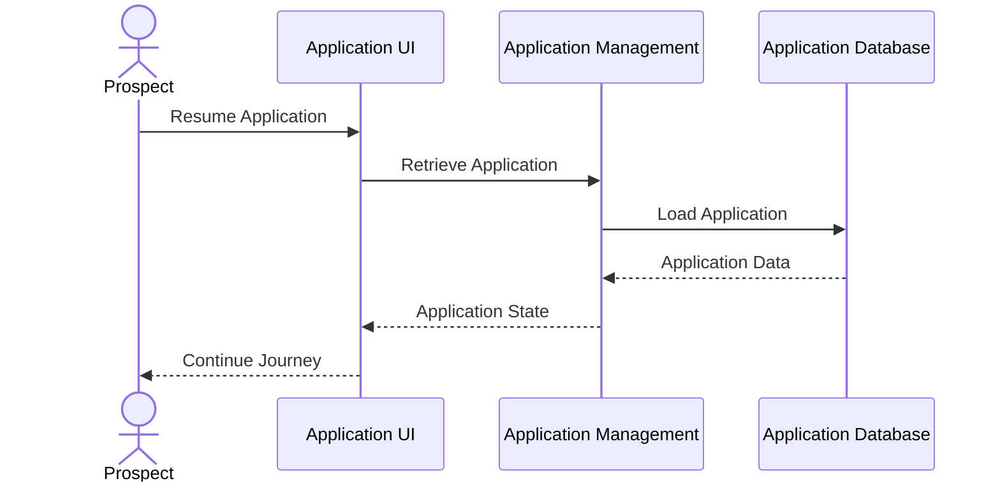
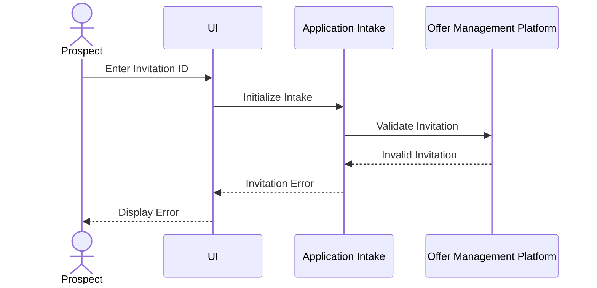
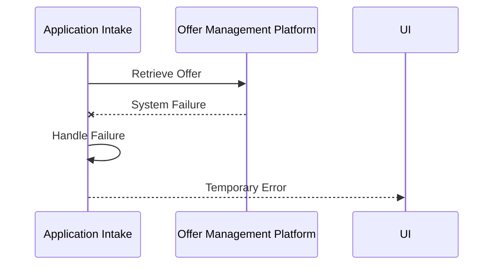
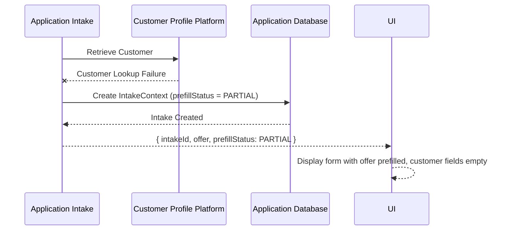
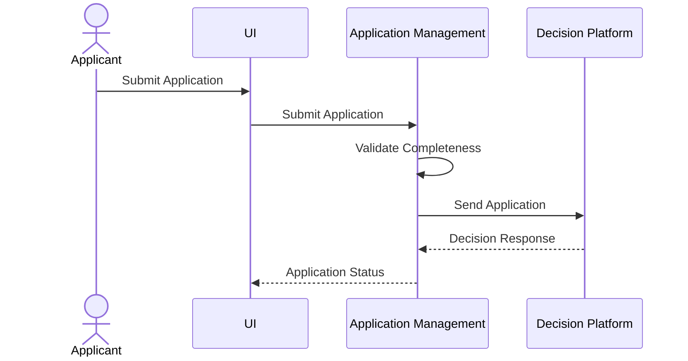

# 04 - Sequence Diagrams

# Personal Loan Application Management

Version: 1.0

Status: Draft

---

# 1. Overview

This document describes the application journey flows for Application Management.

Application Management supports multiple application initiation paths:

1. Invitation Intake
2. Direct Intake

Both paths converge into Application Creation and follow the same application lifecycle.

---

# 2. Invitation Based Intake and Application Creation

## Purpose

Shows the ITA flow. Invitation processing produces prefill data only.
The prospect completes remaining fields before Application is created.

## Step 1 - Initialize Invitation Intake



## Step 2 - Create Application

Prospect reviews prefilled data, completes remaining required fields, then submits.



---

# 3. Direct Application Creation

## Purpose

Shows the flow when a prospect starts without an invitation.
No prefill data is available. Prospect enters all information manually.

## Step 1 - Initialize Direct Intake



## Step 2 - Create Application

Prospect completes all required fields then submits.


---

# 4. Application Resume Flow

## Purpose

Allows prospect to continue an existing application.



---

# 5. Invalid Invitation Flow

## Purpose

Handles invalid or expired invitation.



---

# 6. Offer Retrieval Failure



---

# 7. Customer Profile Failure

Customer lookup failure does not block the intake. IntakeContext is created
with prefillStatus = PARTIAL. Offer data is still returned. Prospect must
manually enter customer information before creating the application.



---

# 8. Application Submission Flow



---

# 9. Key Design Notes

## Application Management owns

* Application lifecycle
* Application state
* Applicant information
* Submission

## Application Intake owns

* Entry channel determination
* Invitation processing
* Direct entry initialization
* Prefill preparation

## External Systems own

Offer Management:

* Invitation validation
* Offer lifecycle

Customer Platform:

* Customer profile

Decision Platform:

* Credit decisioning

```
```
