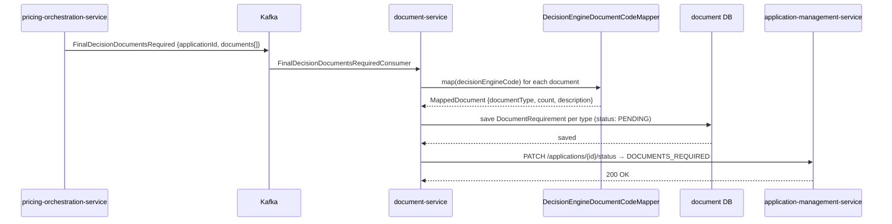
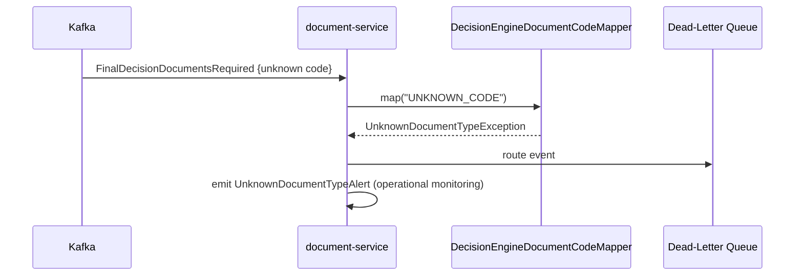
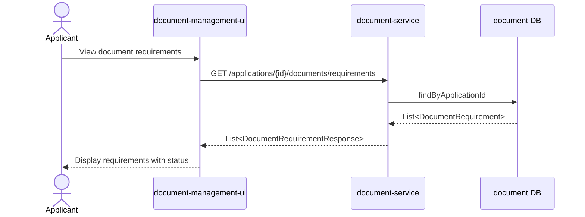
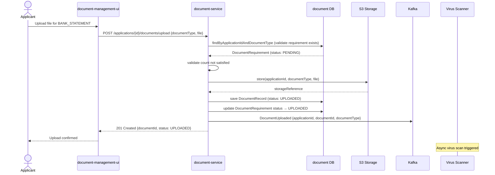
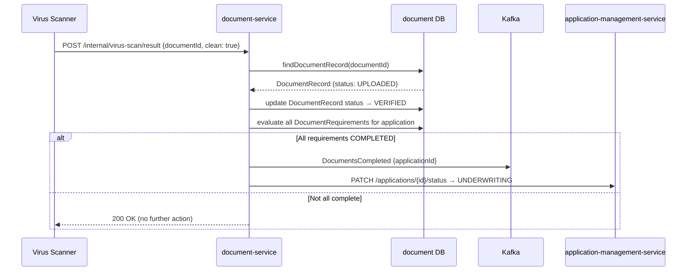
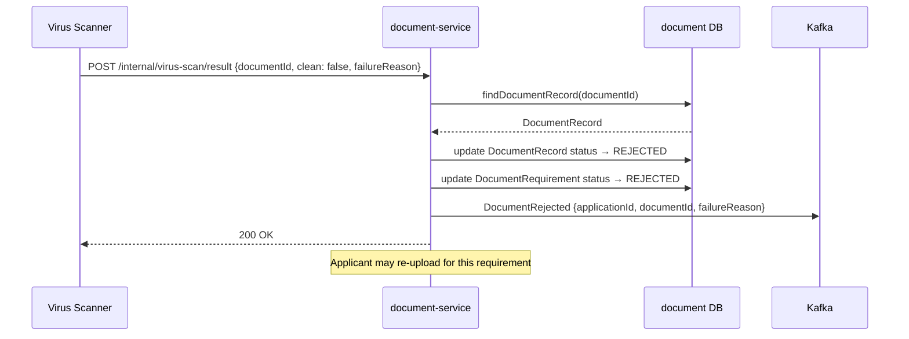
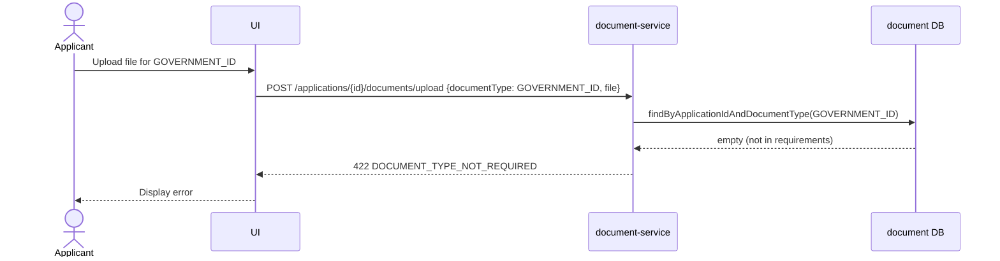

# Sequence Diagrams

# Document Service

Version: 1.0

---

# 1. Document Requirements Stored on Decision Event

---

# 2. Unknown Document Code — Dead-Letter

---

# 3. Applicant Retrieves Document Requirements

---

# 4. Successful Document Upload

---

# 5. Virus Scan — Clean

---

# 6. Virus Scan — Rejected

---

# 7. Upload Rejected — Document Type Not Required

