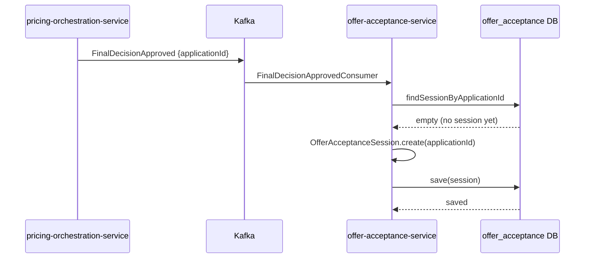
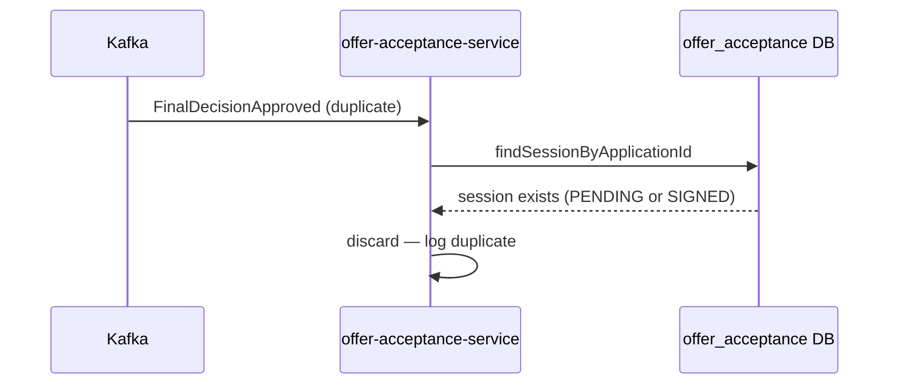
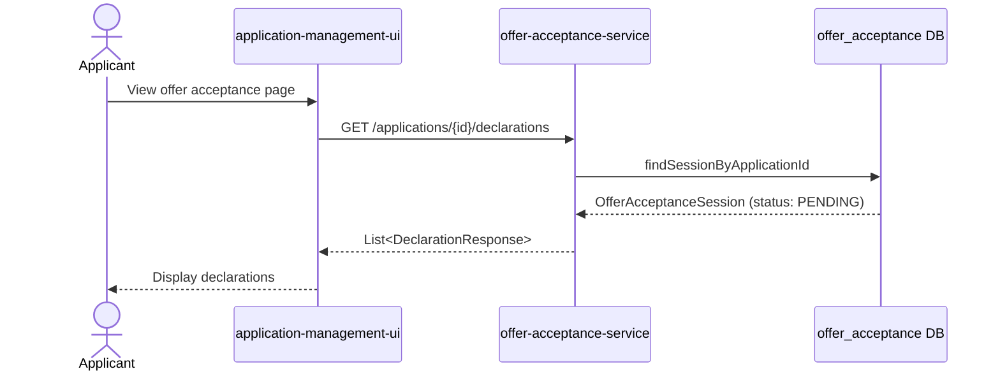
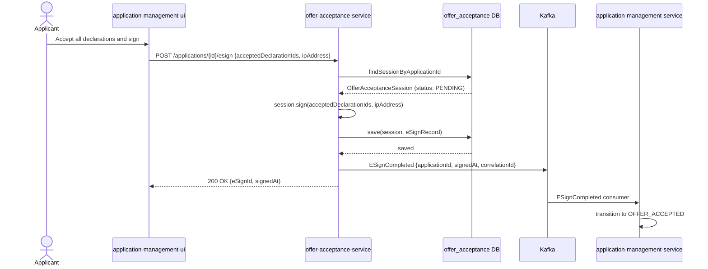
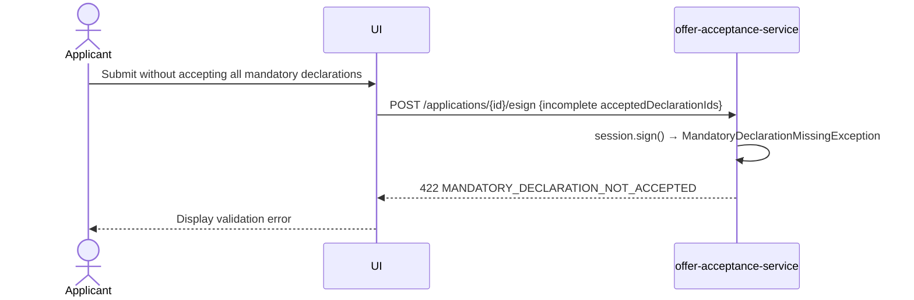
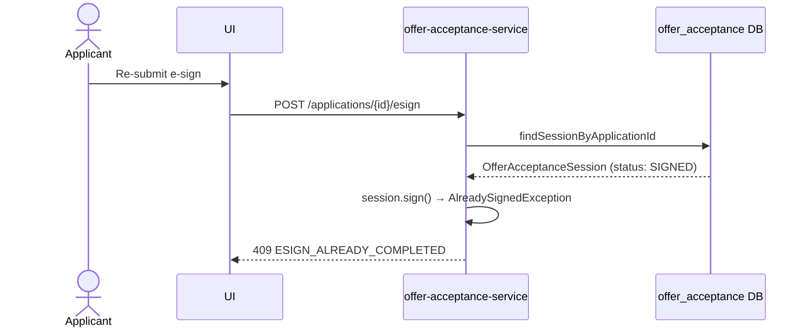

# Sequence Diagrams

# Offer Acceptance Service

Version: 1.0

---

# 1. Session Creation on Approval

---

# 2. Session Creation — Idempotency (Duplicate Event)

---

# 3. Applicant Retrieves Declarations

---

# 4. Applicant Submits E-Sign — All Mandatory Accepted

---

# 5. E-Sign Rejected — Missing Mandatory Declaration

---

# 6. E-Sign Rejected — Already Signed

