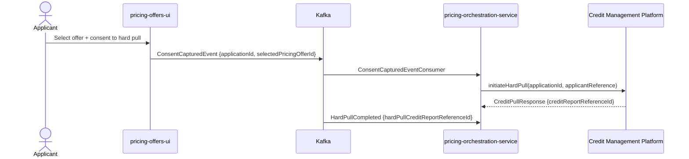
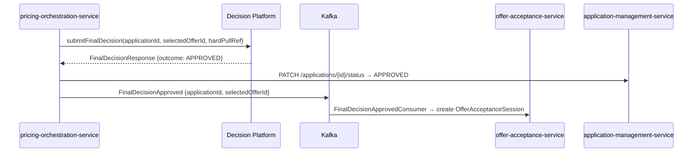
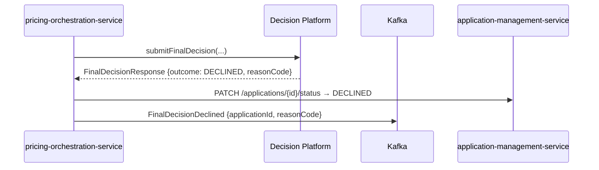
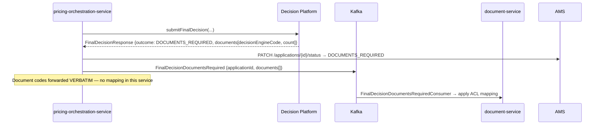
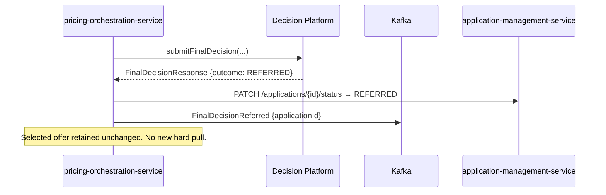

# Sequence Diagrams

# Pricing Orchestration Service

Version: 1.0

---

# 1. Soft Pull and Offer Pricing

```mermaid
sequenceDiagram
    participant AMS as application-management-service
    participant Kafka
    participant POS as pricing-orchestration-service
    participant CMP as Credit Management Platform
    participant DP as Decision Platform (Pricing Engine)

    AMS ->> Kafka: ApplicationCreatedEvent {applicationId}
    Kafka ->> POS: ApplicationCreatedEventConsumer
    POS ->> CMP: initiateSoftPull(applicationId, applicantReference)
    CMP -->> POS: CreditPullResponse {creditReportReferenceId}
    POS ->> POS: assemblePricingRequest(applicationId, softPullRef)
    POS ->> DP: submitPricingRequest(PricingRequest)
    DP -->> POS: PricingEngineResponse {outcome: OFFERS_GENERATED, offers[]}
    POS ->> Kafka: SoftPullCompleted + offers available
    Note over POS: Offers stored; UI retrieves via pricing-offers-ui
```

---

# 2. Offer Selection and Hard Pull



---

# 3. Final Decision — Approved



---

# 4. Final Decision — Declined



---

# 5. Final Decision — Documents Required



---

# 6. Final Decision — Referred


